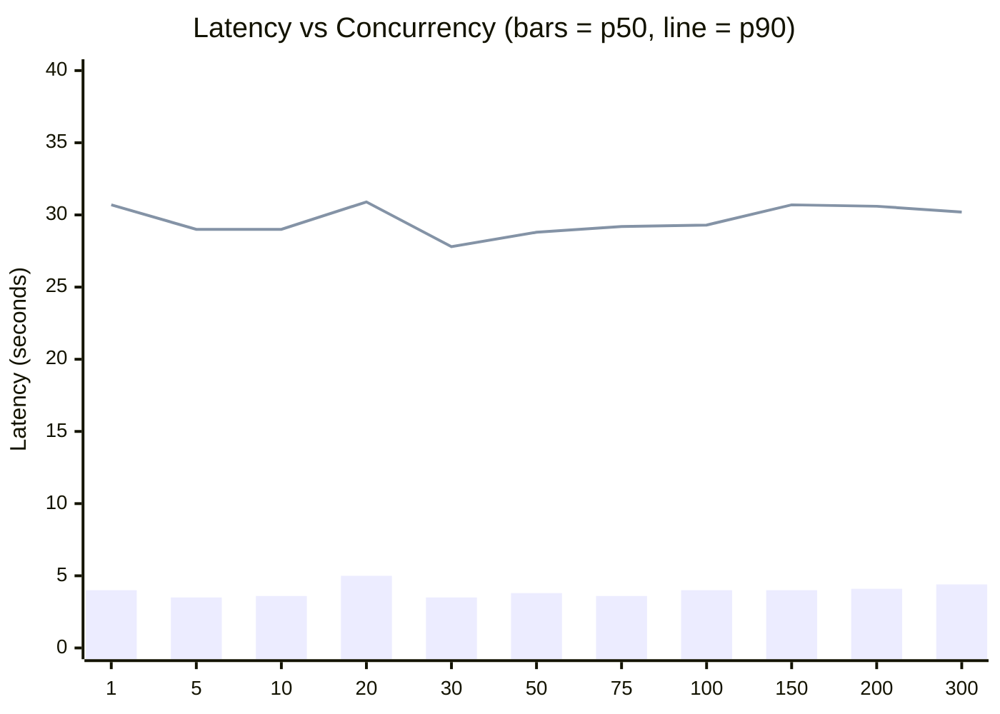
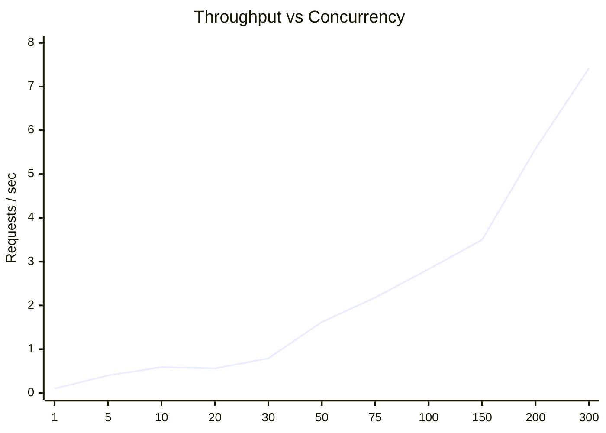
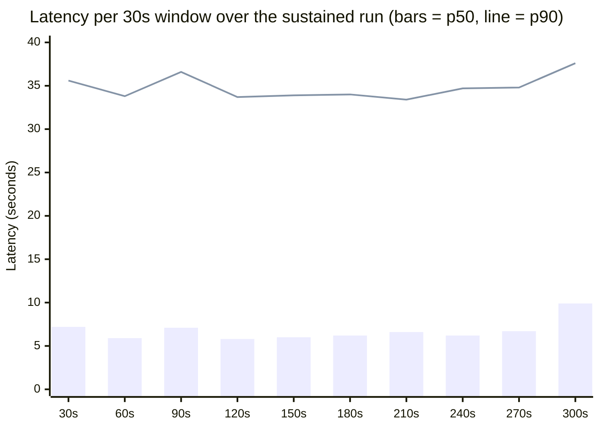
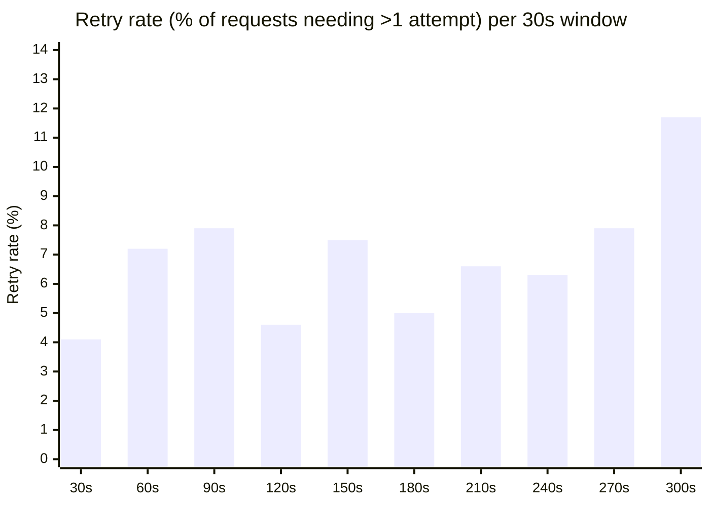
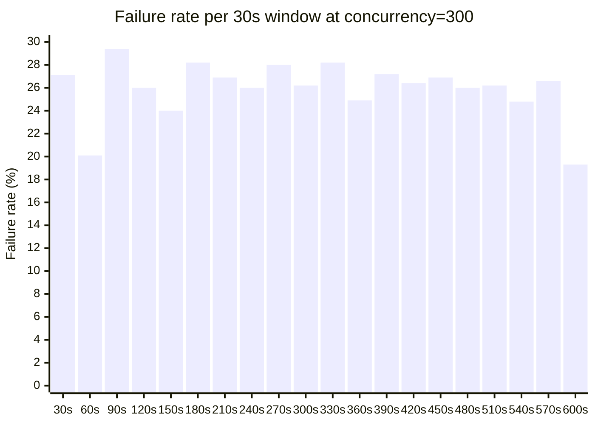
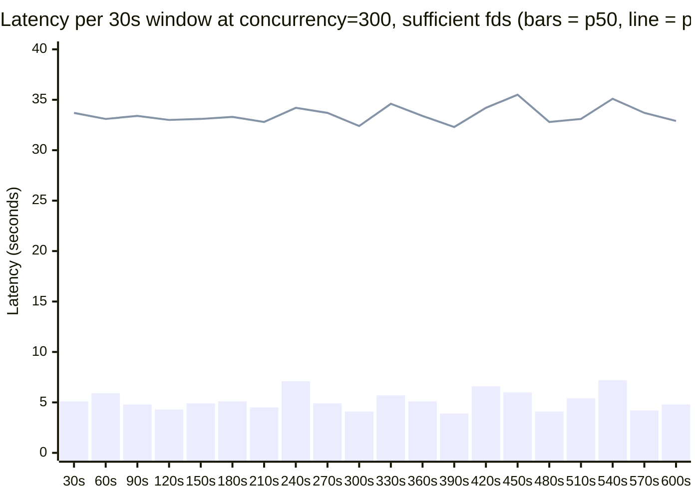
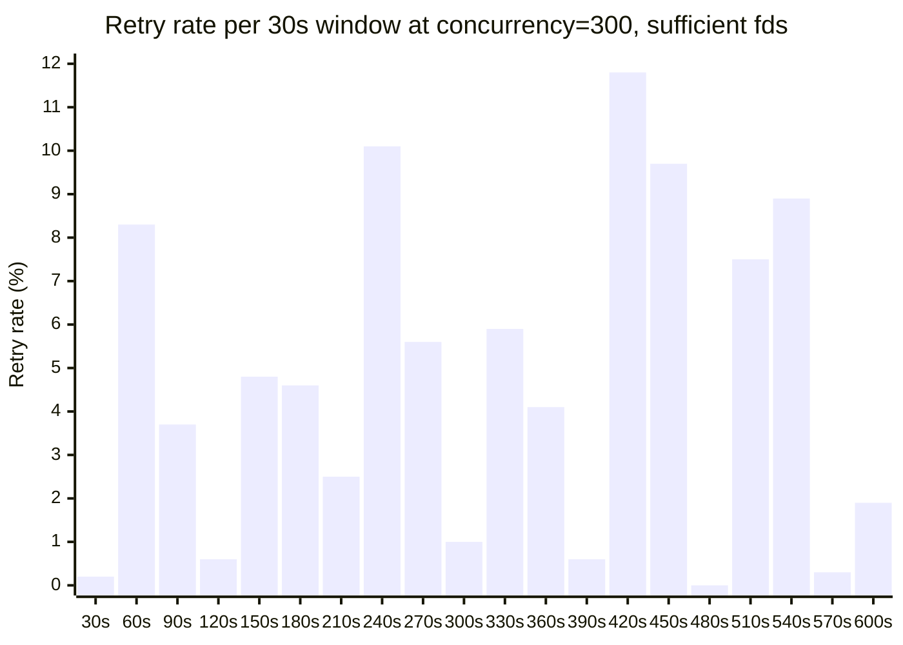

# Findings: Gemini 2.5 Flash Load Test Results

## BLUF

- **Production-viable for this workload, validated up to concurrency 300
  sustained.** Zero failures across a burst sweep to 300, a 200-concurrency
  sustained run (~6 min), and a 300-concurrency sustained run (~11 min,
  15,582 requests) — the last one only after fixing a red herring, below.
- **Real capacity ceiling still unknown — every test so far came back
  clean.** Nothing found where this actually breaks yet; the next useful
  load test is higher concurrency (500-1000+, sustained), not repeating
  what's already validated. See Next Steps.
- **Latency is bimodal at every concurrency level, including
  concurrency=1.** p50 ~3-7s, p90/p99 ~30-45s, with zero contention. This is
  inherent to the Gemini/Vertex backend, not our retry logic or concurrency
  handling — confirmed via retry telemetry (single-attempt-only requests
  carry the same tail).
- **One environmental gotcha worth knowing before running this yourself:**
  a low local file-descriptor limit (`ulimit -n`, 256 by default on macOS)
  produces a wall of `ConnectError`s at high concurrency that looks exactly
  like Vertex rejecting load, but isn't. Cost us a full test cycle before
  we caught it. `Gemini` now warns on startup if this is likely.
- **Biggest model-specific surprise:** Vertex signals blocked or truncated
  content via `finishReason` inside an HTTP 200, not an error status — a
  caller checking only status codes would silently accept bad output.
- **Not done yet:** pushing the concurrency ceiling higher, a temperature
  sweep, 429-vs-5xx retry differentiation, and a deploy pipeline. Full list
  in Next Steps at the bottom.

## Contents

- [Architecture and key decisions](#architecture-and-key-decisions)
- [Workload](#workload)
- [Results](#results)
- [Retry telemetry](#retry-telemetry)
- [Model quirks](#model-quirks)
- [Since the previous run: deadline and concurrency guards added](#since-the-previous-run-deadline-and-concurrency-guards-added)
- [Sustained-load run, concurrency 200, about 6 minutes](#sustained-load-run-concurrency-200-about-6-minutes)
- [Sustained-load run, concurrency 300, attempt 1: false alarm, not the ceiling](#sustained-load-run-concurrency-300-attempt-1-false-alarm-not-the-ceiling)
- [Sustained-load run, concurrency 300, attempt 2: clean](#sustained-load-run-concurrency-300-attempt-2-clean)
- [Open question for a production sign-off](#open-question-for-a-production-sign-off)
- [Next steps](#next-steps)

## Architecture and key decisions

Where this diverged from the existing `Together` provider pattern, and why.
Each of these is a decision with a real tradeoff, not a checklist item —
grouped by concern rather than by when it landed.

### Resilience

- **Retries via `tenacity`'s `AsyncRetrying`**, not hand-rolled.
  `RETRYABLE_STATUS_CODES = {429, 500, 502, 503, 504}` plus
  `httpx.TransportError` get jittered exponential backoff
  (`wait_random_exponential`, capped by `GEMINI_BACKOFF_MAX_SECONDS`);
  everything else (400, a non-retryable 5xx) fails immediately instead of
  burning attempts on something retrying won't fix.
- **Two independent stop conditions**: `stop_after_attempt(GEMINI_MAX_RETRIES)`
  OR `stop_after_delay(GEMINI_REQUEST_DEADLINE_SECONDS)`, whichever fires
  first. Added after realizing the original design had no overall time
  cap — `GEMINI_MAX_RETRIES` × (60s HTTP timeout + up to 20s backoff) could
  in theory run for minutes with nothing bounding total call latency.
- **401/403 raise a distinct `VertexAuthError`**, not the generic
  `RuntimeError` other non-retryable statuses get. An IAM/credentials
  problem needs a different operational response ("fix the service
  account") than a bad request does; lumping them together would have
  hidden that distinction from anyone reading logs later.

### Concurrency and connections

- **`parallelism()` is enforced, not advisory.** `Gemini`/`Together` both
  wrap `ask_generic_question` in an internal `asyncio.Semaphore` sized from
  `parallelism()`, so a caller that doesn't manage its own concurrency no
  longer gets unbounded parallelism by accident — it was previously just a
  suggested number, unenforced.
- **The `httpx` connection pool is sized to match `parallelism()`**, not
  hardcoded. It was originally a fixed `max_connections=200` regardless of
  configured concurrency, which silently capped real throughput below
  whatever `GEMINI_PARALLELISM` claimed — and produced a load-test result
  (the original concurrency=300 sweep, see Results below) that looked clean
  but had actually never tested 300 real connections. Fixed to derive the
  pool size from the same `parallelism` value the semaphore uses.
- **Startup warning for file-descriptor exhaustion.** Raising the
  connection pool to match concurrency surfaced a related problem: at high
  concurrency, a low `ulimit -n` (256 by default on macOS) produces a wall
  of `ConnectError`s that looks exactly like a Vertex-side capacity ceiling
  but isn't. `Gemini.__init__` now checks `resource.getrlimit(RLIMIT_NOFILE)`
  against `parallelism` and logs a warning if it looks insufficient, rather
  than letting this fail silently and confusingly at load-test time — which
  it did, once, before this existed (see the concurrency=300 sections
  below).

### Error handling and observability

- **`finish_reason` is threaded through `SimpleResponse`** end to end.
  Vertex signals blocked/truncated content via `finishReason` inside an
  HTTP 200, not an error status — without surfacing this field, a caller
  checking only status codes would silently accept bad output (see Model
  quirks below).
- **Per-request retry-count telemetry (`attempt_number`)**, added via a
  plain closure variable local to each call rather than reading
  `tenacity`'s own `AsyncRetrying.statistics`. That attribute is backed by
  `threading.local()`, which doesn't isolate concurrent `asyncio` tasks
  sharing one thread — reading it from a `Gemini` instance reused across
  concurrent calls would silently corrupt state between in-flight requests.
  The closure-variable approach is safe by construction, with no shared
  state to race on.
- **Structured JSON logging** (`llm/log_config.py`) — retry attempts, auth
  errors, non-retryable failures, and non-`STOP` finish reasons are all
  logged with structured fields (`status_code`, `finish_reason`,
  `attempt_number`) rather than bare strings, so they're actually queryable
  if shipped somewhere.

### Lifecycle

- **`Gemini` is an async context manager** (`aclose()` / `__aenter__` /
  `__aexit__`) wrapping the underlying `httpx.AsyncClient`. The client
  wasn't being closed at all originally — fine for a load-test script that
  exits, a real leak for a long-lived service.
- **Token refresh moved off the event loop.**
  `google.auth.Credentials.refresh()` is a blocking, synchronous call; it
  now runs via `asyncio.to_thread` under a double-checked `asyncio.Lock`,
  so concurrent callers don't all block the event loop or all trigger
  redundant refreshes at once.

### Load-test harness

- **Added a sustained-duration mode** (`load_test.py sustained`) alongside
  the original concurrency sweep — fixed concurrency for a fixed
  wall-clock duration instead of a fixed request count, with results
  bucketed into time windows so degradation that only shows up partway
  through a long run is visible per-window rather than averaged away. This
  is what caught the retry-rate difference between short bursts and
  sustained load (see the sustained-load sections below).
- **Per-request execution (`_execute_request`) and metric aggregation
  (`summarize_results`) were extracted into shared helpers** used by both
  the sweep and the sustained mode, rather than duplicated — the two modes
  differ only in how they schedule work (a bounded queue vs. a
  time-bounded loop), not in how a single request is executed or
  summarized.

## Workload

`load_test.py` cycles through four short, realistic prompts (customer
support triage, technical doc summarization, code review advice, and a
scheduling email draft) against `gemini-2.5-flash` via Vertex AI's
`generateContent` REST endpoint, at `temperature=0.7`. It sweeps concurrency
levels `[1, 5, 10, 20, 30, 50, 75, 100, 150, 200, 300]`, running
`max(20, concurrency)` requests per level through an `asyncio.Queue` +
worker-pool pattern, with a 3-second cooldown between levels. The client
library's own concurrency guard (`GEMINI_PARALLELISM`, see below) is raised
to the sweep's max for this run so it doesn't mask the test.

## Results

**Zero failures at every concurrency level tested, 1 through 300** — 985
requests total, all successful. The sweep was extended past the
originally-tested ceiling of 100 up to 300 (3x) specifically to find where
this breaks; it didn't, within this range.

**Correction (2026-07-24): the concurrency=300 result above needs a
caveat.** This sweep ran before a later fix to the client's `httpx`
connection-pool sizing. Before that fix, `Gemini`'s connection pool was
hardcoded to `max_connections=200` regardless of the configured
concurrency — so at concurrency=300, the pool itself silently capped true
simultaneous connections at 200, comfortably under this machine's
file-descriptor limit (see the sustained-load sections below). This sweep
validated ≤200 real concurrent connections, not 300; the "zero failures at
300" claim doesn't hold up once that's accounted for. What actually happens
once 300 real concurrent connections are attempted is covered below, and
it isn't zero failures.

**Throughput scales roughly linearly with concurrency, latency doesn't
scale at all.** rps climbs from ~0.10 at concurrency=1 to ~7.42 at
concurrency=300 — an increase almost exactly proportional to the 300x jump
in concurrency — while p50/p90/p99 stay pinned to the same bimodal band at
every level. That's Little's Law doing the work (throughput ≈
concurrency ÷ latency): the backend isn't visibly straining or queueing
under this load, it's just serving more requests in parallel at the same
per-request latency. **We have not yet found Vertex's real ceiling for this
workload** — 300 concurrent requests with zero errors and zero latency
degradation is a good sign, but it means the actual limit (quota-based,
capacity-based, or otherwise) lies somewhere above what we tested here.
Going further (1000+, or sustained rather than one-shot bursts) is the
natural next step but starts trading off real time and API cost against a
take-home's scope.

**Latency is bimodal and flat across concurrency**: p50 sits at ~3.5-5s at
every level, but p90/p95/p99 sit at ~28-37s at every level too — including
concurrency=1, fully sequential, zero contention. This persisted unchanged
through the extended sweep, reinforcing that it's inherent to the
Gemini/Vertex backend's own response-time distribution, not a symptom of
contention or our own retry/concurrency handling (see Retry telemetry
below).

Bars = p50 (typical latency); line = p90 (tail latency). p99 tracks closely
with p90 — see the table below for exact figures.

| concurrency | reqs | rps | p50 | p90 | p95 | p99 | mean |
|---|---|---|---|---|---|---|---|
| 1 | 20 | 0.10 | 4.0s | 30.7s | 33.0s | 37.2s | 10.2s |
| 5 | 20 | 0.40 | 3.5s | 29.0s | 30.2s | 31.1s | 8.9s |
| 10 | 20 | 0.59 | 3.6s | 29.0s | 30.8s | 30.8s | 9.4s |
| 20 | 20 | 0.56 | 5.0s | 30.9s | 32.3s | 35.0s | 10.0s |
| 30 | 30 | 0.79 | 3.5s | 27.8s | 30.4s | 36.2s | 8.7s |
| 50 | 50 | 1.62 | 3.8s | 28.8s | 29.4s | 30.8s | 9.0s |
| 75 | 75 | 2.18 | 3.6s | 29.2s | 30.8s | 32.8s | 9.3s |
| 100 | 100 | 2.83 | 4.0s | 29.3s | 32.1s | 32.8s | 9.4s |
| 150 | 150 | 3.50 | 4.0s | 30.7s | 32.7s | 36.4s | 9.8s |
| 200 | 200 | 5.58 | 4.1s | 30.6s | 31.9s | 35.0s | 10.0s |
| 300 | 300 | 7.42 | 4.4s | 30.2s | 32.8s | 36.6s | 10.3s |

Full per-scenario data, including throughput and token-rate figures, is in
`load_test_results.json`.

## Retry telemetry

Every request in this run reports how many attempts it took (via an
`attempt_number` field on the response). Aggregated per scenario in
`load_test_results.json` as `attempt_count_breakdown`, plus separate latency
percentiles for single-attempt vs. multi-attempt requests.

Across all 985 requests spanning concurrency 1-300: **one single retry
fired**, at concurrency=75 (`attempt_count_breakdown: {"1": 74, "2": 1}`).
That one request succeeded on its second attempt in 10.46s total — well
inside the fast half of the latency distribution, not the ~30s tail. Every
other request at every other concurrency level, including 150/200/300,
succeeded on the first attempt.

This confirms two things: retries work correctly under real (not just
mocked) conditions, and the bimodal p50/p90+ latency tail is *not*
retry-driven — it's present at concurrency=1 with zero retries in-flight,
and the one real retry that did occur landed in the fast portion of the
distribution, not the slow one. The tail is inherent response-time variance
in the Gemini/Vertex backend itself.

## Model quirks

**Vertex signals blocked or truncated output through the response body, not
the HTTP status code.** A blocked prompt (safety filter) or a response that
hits the token limit both come back as HTTP 200 — the only signal is the
`finishReason` field (`SAFETY`, `MAX_TOKENS`, etc.) inside the JSON payload,
or `promptFeedback.blockReason` when no candidate is returned at all. This
was the biggest surprise relative to how a typical REST API signals
failure: a caller that only checks `response.status_code == 200` would
treat a silently-blocked or truncated answer as a normal success.
`finish_reason` is threaded through to `SimpleResponse` specifically so
callers can't miss this; dedicated tests cover the distinct payload shapes
for a normal `STOP`, a `MAX_TOKENS` truncation, a `SAFETY` block with empty
content, and a fully blocked prompt with zero candidates. None of these
showed up in the load test itself — the sample prompts were all benign and
short enough to finish inside the token budget — so this is a code-path/API-
contract finding from building the integration, not something observed
under load.

**`temperature` wasn't varied.** Every request in this test, at every
concurrency level, used `temperature=0.7`, held constant specifically to
isolate latency/throughput/concurrency effects from prompt-response
variance. We have no data on whether temperature moved the bimodal latency
split, output length, or `finishReason` outcomes for this model — that
would need a dedicated experiment rather than a side effect of this load
test, and wasn't in scope for this pass.

## Since the previous run: deadline and concurrency guards added

Two changes landed in the client library between the 100-concurrency run
and this 300-concurrency one, both worth noting since they'd change what
"failure" looks like if the real ceiling is ever found above 300:

- **`GEMINI_REQUEST_DEADLINE_SECONDS`** (default 120s) now bounds the whole
  retry loop, not just each individual HTTP attempt. Previously
  `GEMINI_MAX_RETRIES` × (60s timeout + backoff) had no overall cap, so a
  single call could in theory hang for minutes with no way for a caller to
  bound it short of wrapping every call in their own `asyncio.wait_for`
  (which is what `load_test.py` already did). Past this run's max observed
  latency (~42.8s at concurrency=150), a 120s deadline gives real headroom
  without being toothless.
- **Client-side concurrency enforcement**: `Gemini`/`Together` now cap
  their own in-flight requests via an internal semaphore sized from
  `parallelism()`, instead of `parallelism()` being purely advisory. This
  run raises that cap to 300 (the sweep's max) so it measures the same
  thing the old unenforced version would have; in production, the default
  cap (100) means a caller that doesn't manage its own concurrency no
  longer gets unbounded parallelism by accident.

## Sustained-load run, concurrency 200, about 6 minutes

Every run above is a short burst per concurrency level (20-300 requests,
seconds to tens of seconds). To check whether failure modes only appear
under *sustained* load — a real concern, since quota exhaustion and
backend-side queueing sometimes don't show up in a brief spike — we ran a
separate mode (`load_test.py sustained`) that holds concurrency fixed at
200 and keeps issuing requests for a fixed wall-clock duration instead of a
fixed request count. Workers stop picking up *new* requests once the
duration elapses but let in-flight ones finish, so total wall time (378s)
ran a bit past the requested 300s — consistent with the run's own observed
max latency of 100.7s.

**Zero failures held under sustained load too.** 4,657 requests, 0 errors,
over 378s at concurrency=200. This is the first direct evidence against the
"maybe failures only show up under sustained load" open question below —
at this concurrency, for this duration, they don't.

**Retries are far more common under sustained load than the burst sweep
suggested.** 312 of 4,657 requests (6.7%) needed more than one attempt
(`attempt_count_breakdown`: 1→4345, 2→285, 3→26, 4→1) — compared to 1 retry
in 985 requests (0.1%) in the concurrency sweep above. The short per-level
bursts in that sweep apparently undersampled retries by roughly two orders
of magnitude relative to what a sustained window at fixed concurrency
actually produces. The retry logic is absorbing real, non-trivial
transient-error volume in practice; it's just invisible in
`errors_breakdown` because it's working.

**Retrying is expensive, and now there's enough volume to quantify it.**
`multi_attempt_latency_p50` is 17.8s vs. `single_attempt_latency_p50` 5.9s
(~3x), and p99 is 92.7s vs. 43.6s (~2x). At a 6.7% retry rate this is a real
contributor to overall tail latency, not a rounding error.

**This confirms, rather than reopens, the bimodal-latency conclusion
above.** Restricting to single-attempt-only requests, the tail is still
there: p90=34.3s, p99=43.6s — essentially the same band as the full
concurrency sweep. The ~30-40s tail isn't retry-driven; sustained load adds
a second, smaller, genuinely retry-driven tail on top of it, but doesn't
change the underlying cause of the first one.

| window | reqs | rps | p50 | p90 | p99 | multi-attempt |
|---|---|---|---|---|---|---|
| 0-30s | 533 | 17.8 | 7.2s | 35.6s | 48.1s | 22 (4.1%) |
| 30-60s | 599 | 20.0 | 5.9s | 33.8s | 51.3s | 43 (7.2%) |
| 60-90s | 329 | 11.0 | 7.1s | 36.6s | 50.4s | 26 (7.9%) |
| 90-120s | 540 | 18.0 | 5.8s | 33.7s | 43.9s | 25 (4.6%) |
| 120-150s | 441 | 14.7 | 6.0s | 33.9s | 43.0s | 33 (7.5%) |
| 150-180s | 464 | 15.5 | 6.2s | 34.0s | 50.7s | 23 (5.0%) |
| 180-210s | 484 | 16.1 | 6.6s | 33.4s | 50.5s | 32 (6.6%) |
| 210-240s | 429 | 14.3 | 6.1s | 34.7s | 42.5s | 27 (6.3%) |
| 240-270s | 454 | 15.1 | 6.7s | 34.8s | 48.5s | 36 (7.9%) |
| 270-300s | 384 | 12.8 | 9.9s | 37.6s | 52.9s | 45 (11.7%) |

**No clean degradation-over-time trend, and a reason to be cautious about
the last window specifically.** The final window (270-300s) has the
highest p50 (9.9s vs. 5.8-7.2s elsewhere) and the highest retry rate
(11.7%), which invites a "ramp-up degradation" reading. But it also has the
lowest request count of any window (384) alongside the second-lowest
(60-90s, 329 requests) — and that second window shows the same pattern
(elevated p50, elevated retry rate) in the *middle* of the run, not just at
the end. There's a mechanical reason these can correlate: requests are
bucketed by start time under a fixed 200-worker pool, so a window where
more workers are tied up on slow or retrying requests will show fewer new
request *starts* — and whichever few do start land disproportionately in
the slow/retried tail. That's an artifact of measuring by start-time
against fixed concurrency, not necessarily the backend drifting over the
run. One run isn't enough to distinguish a real time-based trend from this
effect; a longer sustained run (30+ minutes) would be needed to tell them
apart with confidence.

**Ceiling still unknown — this run didn't test it, and now has a better
signal for the next one.** Concurrency was held fixed at 200 throughout;
this shows 200-sustained is clean, not where it breaks. The retry rate
(6.7% here) is arguably a better leading indicator than the error rate for
finding that ceiling, since retries are currently absorbing whatever
transient errors occur before they'd ever surface as a failure. The natural
next step is repeating this sustained shape at a higher fixed concurrency
(300+) and watching whether that retry rate climbs before any outright
failures appear.

## Sustained-load run, concurrency 300, attempt 1: false alarm, not the ceiling

Following the previous section's recommendation, we reran the sustained
mode at a higher fixed concurrency (300) for longer (600s requested, 654s
actual wall time — same in-flight-requests-finish-past-the-deadline
behavior as the 200-concurrency run). This is also the first run in this
document to actually exercise 300 real concurrent connections, since the
connection-pool fix noted in the correction above landed between the
200-concurrency run and this one.

**25.8% of requests failed (4,214 of 16,351), and 99.8% of those failures
were `ConnectError`, not `429`.** Only 7 failures were genuine
`HTTP 429 Resource Exhausted` quota errors; the other 4,207 were the
client failing to establish a connection at all.

**This is a local resource limit, not a Vertex-side capacity signal —
confirmed, not just suspected.** `ulimit -n` on the machine that ran this
returned **256**. 300 concurrent HTTPS connections requires roughly that
many simultaneous file descriptors just for sockets, on top of whatever the
process already holds open (stdio, the JSON log file, etc.) — comfortably
enough to exceed a 256 ceiling. Three things about the data corroborate
this rather than a genuine Vertex-side limit:

- The failure rate is flat from the very first 30s window (27.1%) through
  the last, rather than building up the way a rate-based quota typically
  would. A hard local ceiling produces exactly this shape; a quota being
  gradually exhausted doesn't.
- The failure *type* is almost entirely connection-establishment failure,
  not an HTTP-level rejection. Vertex pushing back on load looks like `429`
  responses (as designed for and correctly retried elsewhere in this
  document); it doesn't look like the client failing to open a socket.
- Real `429`s stayed rare (7 total, 0.04% of all attempts) even while the
  client was firing far more connection attempts than usual — if Vertex
  itself were straining at this load, quota rejections should have scaled
  with attempts, not stayed flat near zero.

**Net effect: we still haven't found Vertex's real ceiling, and we now know
less than the (incorrect) original 300-concurrency sweep result implied.**
Both the burst sweep and this run were capped below 300 real concurrent
connections — one by an internal library bug, the other by the local
environment. A valid test at 300+ concurrency needs the file-descriptor
limit raised first (e.g. `ulimit -n 4096`) on whatever machine runs it;
see the README note and the startup warning added to `Gemini` as a result
of this run, which now surfaces this exact mismatch instead of letting it
present as a mysterious wall of `ConnectError`s.

## Sustained-load run, concurrency 300, attempt 2: clean

Reran the same shape (concurrency=300, 600s requested duration) from an
environment with an ample file-descriptor limit rather than the 256 that
invalidated the previous attempt. This is the first run in this document
that actually validates 300 real concurrent connections against Vertex
end to end.

**Zero failures. 15,582 requests, 680s wall time, 0 errors — no
`ConnectError`, no `429`.** With the local constraint removed, the
`ConnectError` wall from the previous section disappears entirely; nothing
in the data suggests Vertex itself was straining at this load.

**Retry rate went down, not up, going from 200 to 300 concurrency.** 700 of
15,582 requests (4.5%) needed a second-plus attempt here, versus 6.7% in
the 200-concurrency sustained run. That's the opposite of what the
"watch the retry rate for a leading indicator of an approaching ceiling"
plan from the previous section would predict if 300 were close to a real
limit — if anything this reads as more headroom, not less. (Recall this
metric is unambiguous here specifically because there are zero failures to
conflate it with — see the caveat about `attempt_count_breakdown` mixing
successes and failures, which only bites when failures exist.)

**Latency is, if anything, slightly better than the 200-concurrency run,
and the bimodal shape is unchanged.** p50=5.0s, p90=33.4s, p95=36.4s,
p99=44.6s, mean=11.9s — every one of those is at or below the
200-concurrency run's equivalent figure (p50 6.4s, p90 34.8s, p95 38.8s,
p99 48.5s, mean 13.5s). The difference is small enough to be run-to-run
noise rather than a real trend, but it's certainly not degradation.
Multi-attempt requests are still the expensive ones (p50 15.1s, p99 90.7s
vs. single-attempt's p50 4.8s, p99 41.8s) — consistent with every prior
run.

Retry rate per window bounces between 0% and 11.8% with no trend by time —
the highest window (14th, at 11.8%) sits in the middle of the run, and the
lowest (16th, 0%) is near the end, which is the same "noisy, not trending"
shape the 200-concurrency run showed and reinforces that this is inherent
per-request variance rather than a load-dependent effect building up over
the run.

**Bottom line: concurrency=300 sustained for over 11 minutes is clean
against Vertex.** The real ceiling for this workload is still unlocated —
this run answers "is 300 safe," not "where does it actually break" — but
300 is no longer a question mark, and the leading indicator this document
proposed watching (retry rate) gave no warning sign at that level. The
natural next step, if it's still worth chasing, is repeating this shape at
a higher concurrency again (500+, sustained) with fd limits already
accounted for from the start.

Raw per-window data for both concurrency=300 sustained attempts is on disk
for reference: the invalidated one at
`sustained_300_fdlimited_load_test_results.json`, this clean one at
`sustained_300_clean_load_test_results.json`.

## Open question for a production sign-off

The real capacity ceiling for `gemini-2.5-flash` under this workload is
still unknown, but concurrency=300 sustained for over 11 minutes is now a
confirmed-clean data point, not just an aspiration. Four tests have been
run against this workload: a burst sweep to 300 (invalidated — capped at
200 by a library bug), a sustained run at 200 (clean), a sustained run at
300 (invalidated — capped by a local file-descriptor limit, `ConnectError`
storm, nothing to do with Vertex), and a repeat of that same 300-concurrency
sustained run with the file-descriptor constraint removed (clean: 15,582
requests, 680s, zero failures). That last run is the first one in this
document that actually proves what it claims to prove.

The retry-rate signal this document proposed watching for as a leading
indicator gave no warning at 300 — if anything it went down relative to
200 (4.5% vs. 6.7%), and latency was flat-to-slightly-better, not worse.
Nothing in the data suggests 300 is close to a real ceiling. The next load
test, if it's worth the time/cost tradeoff, is repeating this same shape
(sustained, not burst) at a meaningfully higher concurrency — 500 or
1000 — with the file-descriptor limit accounted for from the start (the
`Gemini` startup warning added as a result of this exercise should catch
that automatically now) and watching the same retry-rate signal for the
first time it actually moves.

## Next steps

This take-home was timeboxed, so this is a prioritized punch list rather
than a completed checklist — roughly ordered by what would most change a
production sign-off decision:

1. **Push the concurrency ceiling higher, sustained.** 500-1000+, with the
   file-descriptor limit raised up front. Every test so far has come back
   clean; we still don't know where this actually breaks, only that it's
   above 300.
2. **Run a longer sustained window (30+ minutes) at a fixed concurrency.**
   The 200-concurrency run's last time-window showed a small uptick in
   latency and retry rate that's most likely a measurement artifact (see
   that section), but a single 6-minute run can't fully rule out genuine
   time-based drift. A longer run would.
3. **Vary `temperature`.** Held constant at 0.7 throughout every test here
   specifically to isolate concurrency effects — we have no data on whether
   it moves latency, output length, or `finishReason` outcomes.
4. **Differentiate `429` from `5xx` in the retry policy, and read Vertex's
   `Retry-After` header if it sends one.** Both currently get identical
   jittered backoff. Low urgency — only 7 real `429`s showed up across
   every test run combined — but worth closing before scaling further.
5. **Add metrics/dashboarding beyond structured logs.** Retry counts,
   attempt numbers, and non-`STOP` finish reasons are all logged per
   request today (`llm/log_config.py`), but nothing aggregates them into a
   dashboard or alert. Fine for a load-test harness, not for an on-call
   rotation.
6. **Add a Dockerfile and a deploy pipeline.** CI (lint + test on every PR)
   exists; packaging and deployment don't. Expected gap at take-home scope,
   but a real one before this runs anywhere for real.
