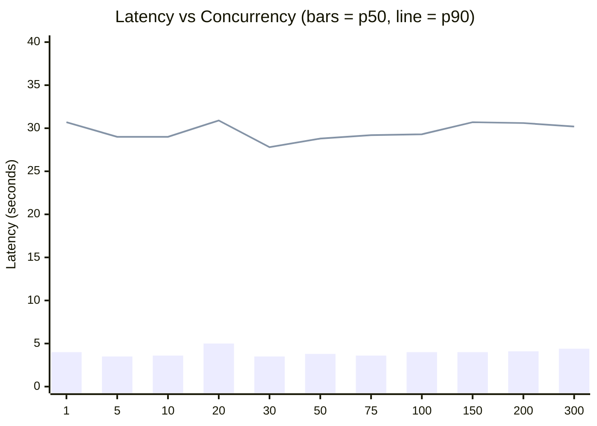
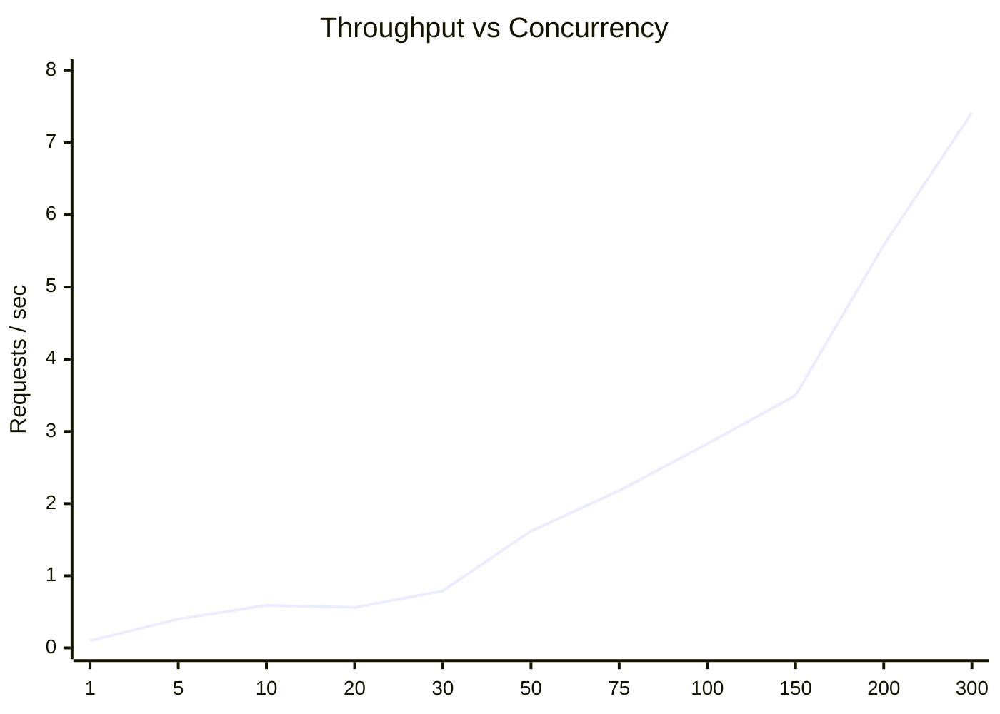

# Findings: Gemini 2.5 Flash Load Test Results

## Workload

`load_test.py` cycles through four short, realistic prompts (customer
support triage, technical doc summarization, code review advice, and a
scheduling email draft) against `gemini-2.5-flash` via Vertex AI's
`generateContent` REST endpoint, at `temperature=0.7`. It sweeps concurrency
levels `[1, 5, 10, 20, 30, 50, 75, 100, 150, 200, 300]`, running
`max(20, concurrency)` requests per level through an `asyncio.Queue` +
worker-pool pattern, with a 3-second cooldown between levels. The client
library's own concurrency guard (`GEMINI_PARALLELISM`, see below) is raised
to the sweep's max for this run so it doesn't mask the test.

## Results

**Zero failures at every concurrency level tested, 1 through 300** — 985
requests total, all successful. The sweep was extended past the
originally-tested ceiling of 100 up to 300 (3x) specifically to find where
this breaks; it didn't, within this range.

**Throughput scales roughly linearly with concurrency, latency doesn't
scale at all.** rps climbs from ~0.10 at concurrency=1 to ~7.42 at
concurrency=300 — an increase almost exactly proportional to the 300x jump
in concurrency — while p50/p90/p99 stay pinned to the same bimodal band at
every level. That's Little's Law doing the work (throughput ≈
concurrency ÷ latency): the backend isn't visibly straining or queueing
under this load, it's just serving more requests in parallel at the same
per-request latency. **We have not yet found Vertex's real ceiling for this
workload** — 300 concurrent requests with zero errors and zero latency
degradation is a good sign, but it means the actual limit (quota-based,
capacity-based, or otherwise) lies somewhere above what we tested here.
Going further (1000+, or sustained rather than one-shot bursts) is the
natural next step but starts trading off real time and API cost against a
take-home's scope.

**Latency is bimodal and flat across concurrency**: p50 sits at ~3.5-5s at
every level, but p90/p95/p99 sit at ~28-37s at every level too — including
concurrency=1, fully sequential, zero contention. This persisted unchanged
through the extended sweep, reinforcing that it's inherent to the
Gemini/Vertex backend's own response-time distribution, not a symptom of
contention or our own retry/concurrency handling (see Retry telemetry
below).

Bars = p50 (typical latency); line = p90 (tail latency). p99 tracks closely
with p90 — see the table below for exact figures.

| concurrency | reqs | rps | p50 | p90 | p95 | p99 | mean |
|---|---|---|---|---|---|---|---|
| 1 | 20 | 0.10 | 4.0s | 30.7s | 33.0s | 37.2s | 10.2s |
| 5 | 20 | 0.40 | 3.5s | 29.0s | 30.2s | 31.1s | 8.9s |
| 10 | 20 | 0.59 | 3.6s | 29.0s | 30.8s | 30.8s | 9.4s |
| 20 | 20 | 0.56 | 5.0s | 30.9s | 32.3s | 35.0s | 10.0s |
| 30 | 30 | 0.79 | 3.5s | 27.8s | 30.4s | 36.2s | 8.7s |
| 50 | 50 | 1.62 | 3.8s | 28.8s | 29.4s | 30.8s | 9.0s |
| 75 | 75 | 2.18 | 3.6s | 29.2s | 30.8s | 32.8s | 9.3s |
| 100 | 100 | 2.83 | 4.0s | 29.3s | 32.1s | 32.8s | 9.4s |
| 150 | 150 | 3.50 | 4.0s | 30.7s | 32.7s | 36.4s | 9.8s |
| 200 | 200 | 5.58 | 4.1s | 30.6s | 31.9s | 35.0s | 10.0s |
| 300 | 300 | 7.42 | 4.4s | 30.2s | 32.8s | 36.6s | 10.3s |

Full per-scenario data, including throughput and token-rate figures, is in
`load_test_results.json`.

## Retry telemetry

Every request in this run reports how many attempts it took (via an
`attempt_number` field on the response). Aggregated per scenario in
`load_test_results.json` as `attempt_count_breakdown`, plus separate latency
percentiles for single-attempt vs. multi-attempt requests.

Across all 985 requests spanning concurrency 1-300: **one single retry
fired**, at concurrency=75 (`attempt_count_breakdown: {"1": 74, "2": 1}`).
That one request succeeded on its second attempt in 10.46s total — well
inside the fast half of the latency distribution, not the ~30s tail. Every
other request at every other concurrency level, including 150/200/300,
succeeded on the first attempt.

This confirms two things: retries work correctly under real (not just
mocked) conditions, and the bimodal p50/p90+ latency tail is *not*
retry-driven — it's present at concurrency=1 with zero retries in-flight,
and the one real retry that did occur landed in the fast portion of the
distribution, not the slow one. The tail is inherent response-time variance
in the Gemini/Vertex backend itself.

## Since the previous run: deadline and concurrency guards added

Two changes landed in the client library between the 100-concurrency run
and this 300-concurrency one, both worth noting since they'd change what
"failure" looks like if the real ceiling is ever found above 300:

- **`GEMINI_REQUEST_DEADLINE_SECONDS`** (default 120s) now bounds the whole
  retry loop, not just each individual HTTP attempt. Previously
  `GEMINI_MAX_RETRIES` × (60s timeout + backoff) had no overall cap, so a
  single call could in theory hang for minutes with no way for a caller to
  bound it short of wrapping every call in their own `asyncio.wait_for`
  (which is what `load_test.py` already did). Past this run's max observed
  latency (~42.8s at concurrency=150), a 120s deadline gives real headroom
  without being toothless.
- **Client-side concurrency enforcement**: `Gemini`/`Together` now cap
  their own in-flight requests via an internal semaphore sized from
  `parallelism()`, instead of `parallelism()` being purely advisory. This
  run raises that cap to 300 (the sweep's max) so it measures the same
  thing the old unenforced version would have; in production, the default
  cap (100) means a caller that doesn't manage its own concurrency no
  longer gets unbounded parallelism by accident.

## Open question for a production sign-off

The real capacity ceiling for `gemini-2.5-flash` under this workload is
still unknown — we've now shown 3x more headroom than the original test
found (zero failures to 300, up from 100), but that just moved the unknown
further out, it didn't locate it. Before calling this "proven at
production scale," the next load test should either push concurrency
substantially higher (the linear throughput scaling observed here gives no
indication of where it would start to bend) or run at a fixed high
concurrency for a sustained duration rather than a short burst per level,
since quota exhaustion and rate limiting sometimes only show up under
sustained load rather than a brief spike.
